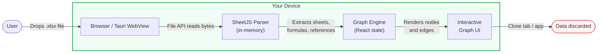
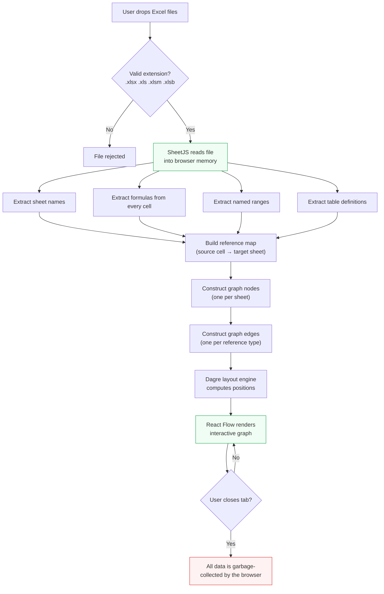
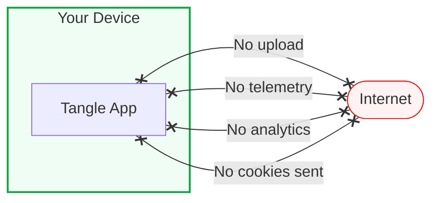
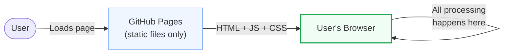

# Data Security Review

> **Summary for senior leaders:** Tangle processes Excel files entirely on your
> device. No spreadsheet data is uploaded, transmitted, or stored on any server.
> Files are read in browser memory, rendered as a graph, and discarded when you
> close the tab or app. There is no back-end, no database, no analytics, and no
> telemetry.

---

## Contents

1. [Data flow overview](#data-flow-overview)
2. [Detailed processing pipeline](#detailed-processing-pipeline)
3. [What data stays on your machine](#what-data-stays-on-your-machine)
4. [What leaves your machine](#what-leaves-your-machine)
5. [Desktop app (Tauri) permissions](#desktop-app-tauri-permissions)
6. [Web version hosting](#web-version-hosting)
7. [Dependency review](#dependency-review)
8. [Frequently asked questions](#frequently-asked-questions)

---

## Data flow overview

The diagram below shows the complete lifecycle of an Excel file in Tangle.
Every step occurs **locally in the browser or desktop app**.



There are **no arrows leaving "Your Device"**. That is the key takeaway.

---

## Detailed processing pipeline



### Key points

| Step | Where it runs | Data stored? |
|------|---------------|--------------|
| File read | Browser `FileReader` API | In-memory only |
| Excel parse | SheetJS (JavaScript, in-page) | In-memory only |
| Graph build | React state | In-memory only |
| Graph render | HTML canvas via React Flow | In-memory only |
| Session end | Browser garbage collection | **Nothing persisted** |

---

## What data stays on your machine

Everything. Specifically:

- **File bytes** — read via the browser `File` API; never written to disk or
  sent over the network.
- **Parsed formulas and references** — held in React component state for the
  duration of the session.
- **Graph layout** — node positions computed by the Dagre library in JavaScript.
- **No cookies, localStorage, sessionStorage, or IndexedDB** — Tangle uses
  none of these. Closing the tab erases all session data.

---

## What leaves your machine

**Nothing.** The application makes zero outbound network requests with your data.



Verified by code inspection:

| Check | Result |
|-------|--------|
| `fetch()` calls with user data | None |
| `XMLHttpRequest` usage | None |
| WebSocket connections | None |
| Analytics scripts (Google Analytics, Segment, etc.) | None |
| Tracking pixels | None |
| External `<script>` tags in `index.html` | None |
| Cookies or local storage writes | None |

---

## Desktop app (Tauri) permissions

The Windows desktop build uses [Tauri v2](https://tauri.app/), which enforces a
strict capability-based permission model. Tangle requests only the bare minimum:

```json
{
  "identifier": "default",
  "permissions": ["core:default"]
}
```

| Capability | Granted? | Notes |
|------------|----------|-------|
| File system read/write | ❌ No | Files are read via the browser File API, not Tauri's fs plugin |
| Network / HTTP | ❌ No | No network plugin is loaded |
| Shell / command execution | ❌ No | No shell plugin is loaded |
| Clipboard | ❌ No | Not requested |
| Notifications | ❌ No | Not requested |
| System tray | ❌ No | Not requested |

The Tauri backend (Rust) contains **no custom IPC commands** — it only
initializes the webview and a debug-only log plugin.

---

## Web version hosting

The live demo at [bizbrf.github.io/tangle](https://bizbrf.github.io/tangle) is
a static site served by GitHub Pages. It consists of pre-built HTML, CSS, and
JavaScript files — no server-side processing.



GitHub Pages serves the built assets. After the page loads, **all subsequent
processing is offline-capable** — no further requests to GitHub are required to
parse and visualize Excel files.

---

## Dependency review

All runtime dependencies are JavaScript libraries that execute client-side:

| Dependency | Purpose | Network activity |
|------------|---------|-----------------|
| [SheetJS (xlsx)](https://sheetjs.com/) | Parse Excel binary formats | None |
| [@xyflow/react](https://reactflow.dev/) | Render interactive node graph | None |
| [dagre](https://github.com/dagrejs/dagre) | Compute graph layout | None |
| [React 19](https://react.dev/) | UI framework | None |
| [Tailwind CSS v4](https://tailwindcss.com/) | Styling (build-time only) | None |

No dependency makes network requests at runtime. The application can function
fully air-gapped after the initial page load.

---

## Frequently asked questions

### Can IT / security teams audit the code?

Yes. Tangle is open source under the MIT license. The full source code is at
[github.com/bizbrf/tangle](https://github.com/bizbrf/tangle).

### Does Tangle store any files on disk?

No. Files are read into browser memory and never written to the file system.
When you close the tab or app, the browser's garbage collector frees all memory.

### Can Tangle be used on an air-gapped network?

Yes. The desktop installer works without internet access. The web version only
needs connectivity for the initial page load; after that, all processing is
offline.

### Is there any way data could leak through browser extensions or OS features?

Tangle itself transmits nothing. However, browser extensions, OS-level screen
capture, or clipboard managers are outside the application's control. Standard
endpoint security policies apply as they would for any local application.

### What about the Content Security Policy (CSP)?

The Tauri desktop build sets CSP to `null` (disabled). This is acceptable
because the app loads no external resources and has no server-side component.
The web version inherits GitHub Pages' default headers. Adding a strict CSP is a
future improvement tracked in the project's issues.

---

*Last reviewed: March 2026*
